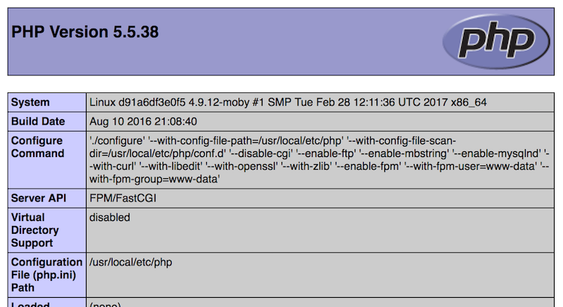

# docker-php-fpm

This is a docker php fpm image, based on the official php fpm image. It has the following additions:

- extensions
  - memcached (2.2.0 for php <7.0, 3.0.3 for php >=7.0)
  - gd (2.1.0)
    - png (1.2.50)
    - jpeg (6b)
    - webp
    - freetype (2.5.2)
    - gif create/read
    - wbmp
    - xpm
    - xbm
  - zip (1.11.0, lib: 0.10.1)
  - intl (1.1.0, icu: 52.1)
  - mysqli (5.0.11-dev)
  - pdo_mysql (5.0.11-dev)
  - opcache
  - soap
- composer cli (1.4.1)
- git cli (2.1.4)
- vim (7.4)
- possibility to override special php ini settings with environment variables: (see included php.ini for a full list, see [this blog post for reasons](https://dracoblue.net/dev/use-environment-variables-for-php-ini-settings-in-docker/)):
```ini
memory_limit=${PHP_MEMORY_LIMIT};
post_max_size=${PHP_POST_MAX_SIZE};
max_file_uploads=${PHP_MAX_FILE_UPLOADS};
upload_max_filesize=${PHP_UPLOAD_MAX_FILESIZE};
session.save_path=${PHP_SESSION_SAVE_PATH};
session.save_handler=${PHP_SESSION_SAVE_HANDLER};
max_input_vars=${PHP_MAX_INPUT_VARS};
```

## Usage "docker"

### Run PHP-FPM Server

```console
$ docker run --rm -p 9000:9000 -v `pwd`:/usr/src/app exozet/php-fpm
```

### Run PHP-CLI

If you want to launch a shell:

```console
$ docker run --rm -it -v `pwd`:/usr/src/app --user www-data exozet/php-fpm bash
```

If you want to run a php command:

```console
$ docker run --rm -it -v `pwd`:/usr/src/app --user www-data exozet/php-fpm php -v
PHP 5.5.38 (cli) (built: Aug 10 2016 21:09:37)
Copyright (c) 1997-2015 The PHP Group
Zend Engine v2.5.0, Copyright (c) 1998-2015 Zend Technologies
    with Zend OPcache v7.0.6-dev, Copyright (c) 1999-2015, by Zend Technologies
```

If you want to run composer:

```console
$ docker run --rm -it -v `pwd`:/usr/src/app --user www-data exozet/php-fpm composer --version
Composer version 1.4.1 2017-03-10 09:29:45
```

## Usage "docker-compose"

Create a `docker-compose.yml`:

```yaml
version: "2.1"

services:
  php-cli:
    image: exozet/php-fpm:5.5.38-sudo
    volumes:
      - ./:/usr/src/app
    user: www-data
    entrypoint: bash
    depends_on:
      - nginx
  php-fpm:
    image: exozet/php-fpm:5.5.38
    volumes:
      - ./:/usr/src/app
  nginx:
    image: nginx:1.11.10
    depends_on:
      - php-fpm
    ports:
      - "8080:8080"
    volumes:
      - ./:/usr/src/app
      - ./nginx.conf:/etc/nginx/conf.d/default.conf
```

Create a `nginx.conf`:
```text
server {
    listen 8080 default_server;
    root /usr/src/app;

    location ~ \.php$ {
        fastcgi_pass php-fpm:9000;
        fastcgi_split_path_info ^(.+\.php)(/.*)$;
        include fastcgi_params;
        fastcgi_param SCRIPT_FILENAME $realpath_root$fastcgi_script_name;
        fastcgi_param DOCUMENT_ROOT $realpath_root;
    }
}
```

Create an `index.php`:

``` php
<?php

phpinfo();
```

Launch the php cli bash:

``` console
$ docker-compose run --rm php-cli
Creating network "dockerphpfpm_default" with the default driver
Creating dockerphpfpm_php-fpm_1
Creating dockerphpfpm_nginx_1
www-data@bf4eb5663c05:/usr/src/app$ ls -al
total 592
drwxr-xr-x 8 www-data www-data    510 Mar 17 13:05 .
drwxr-xr-x 3 root     root       4096 Mar 17 13:05 ..
-rw-r--r-- 1 www-data www-data    478 Mar 17 13:02 docker-compose.yml
-rw-r--r-- 1 www-data www-data    350 Mar 17 12:55 nginx.conf
-rw-r--r-- 1 www-data www-data     18 Mar 17 13:03 index.php
```

Open the nginx+php-fpm at <http://localhost:8080/>:



## LICENSE

The docker-php-fpm is copyright by Exozet (http://exozet.com) and licensed under the terms of MIT License.

